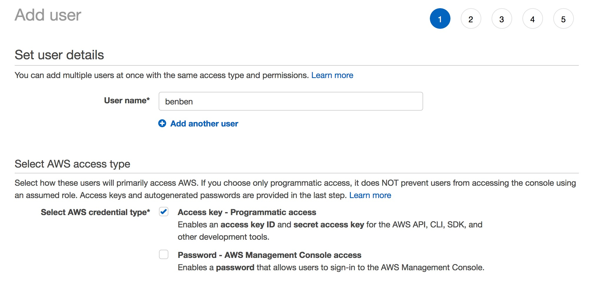
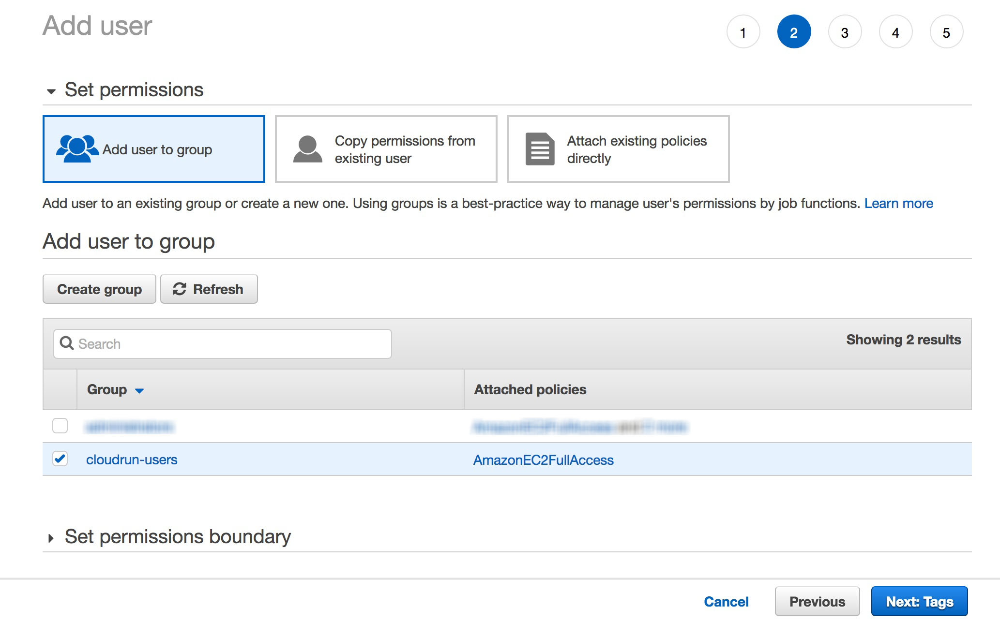
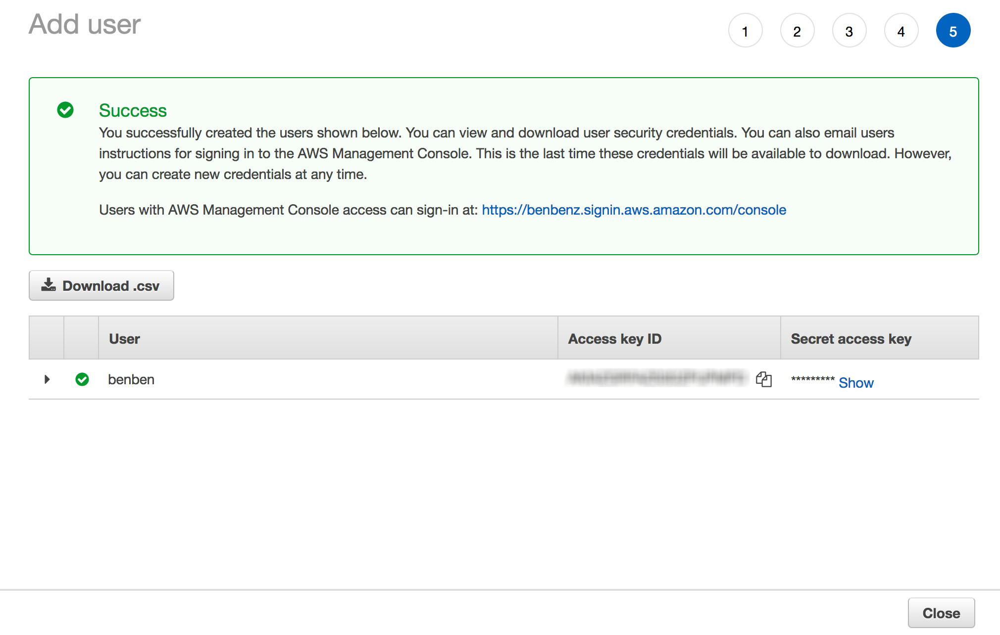

# Description

CloudSend is a Python package that allows you to run any script on a cloud service (for now AWS only).

# Features

- Easily run scripts on AWS by writing a simple configuration file
- Handles Python and Julia scripts, or any command
- Handles PyPi , Conda/Mamba, Apt-get and Julia environments
- Concurrent instance support
- Handles disconnections from instances, including stopped or terminated instances
- Handles interruption of CloudSend, with state recovery
- Runs locally or on a remote instance, with 'watcher' functionality 

| Important Note |
| --- |
| CloudSend helps you easily create instances on AWS so that you can focus on your scripts. It is important to realize that it can and **will likely generate extra costs**. If you want to minimize those costs, activate the `eco` mode in the configuration or make sure you monitor the resources created by CloudSend. Those include: <ul><li>VPCs</li><li>Subnets</li><li>Security Groups</li><li>Instances</li><li>Device Mappings / Disks</li><li>Policies &amp; Roles</li><li>KeyPairs</li></ul>|

# Pre-requisites

In order to use the python AWS client (Boto3), you need to have an existing AWS account and to setup your computer for AWS.

## with AWS CLI

1. Go to [the AWS Signup page](https://portal.aws.amazon.com/billing/signup#/start/email) and create an account
2. Download [the AWS CLI](https://docs.aws.amazon.com/cli/latest/userguide/getting-started-install.html)
3. In the AWS web console, [create a user with administrator privilege](https://docs.aws.amazon.com/streams/latest/dev/setting-up.html)
4. In the AWS web console, under the AMI section, click on the new user and make sure you create an access key under the tab "Security Credentials". Make sure "Console Password" is Enabled as well
5. In ther Terminal, use the AWS CLI to setup your configuration:
```
aws configure
```
See [https://docs.aws.amazon.com/cli/latest/userguide/cli-configure-quickstart.html](here)

6. To run in `remote` mode, you also need to [add the following credentials to your user](https://docs.aws.amazon.com/AWSEC2/latest/UserGuide/iam-roles-for-amazon-ec2.html) (maybe):
- iam:PassRole
- iam:CreateRole
- ec2:AssociateIamInstanceProfile
- ec2:ReplaceIamInstanceProfileAssociation

## manually

1. Go to [the AWS Signup page](https://portal.aws.amazon.com/billing/signup#/start/email) and create an account
2. In the AWS web console, [create a user with administrator privilege](https://docs.aws.amazon.com/streams/latest/dev/setting-up.html)
3. In the AWS web console, under the IAM section, click on the new user and make sure you create an access key under the tab "Security Credentials". Make sure "Console Password" is Enabled as well
4. Add your new user credentials manually, [in the credentials file](https://docs.aws.amazon.com/cli/latest/userguide/cli-configure-profiles.html)

##### '~/.aws/config' example ('C:\Users\USERNAME\\.aws\config' on Windows)

```
[default]
region = eu-west-3
output = json
```

##### '~/.aws/credentials' example ('C:\Users\USERNAME\\.aws\credentials' on Windows)

```
[default]
aws_access_key_id = YOUR_ACCESS_KEY_ID
aws_secret_access_key = YOUR_SECRET_ACCESS_KEY
```

## Setting up a separate user with least permissions (manually) 

1. In the AWS web console, in the IAM service, create a group 'cloudsend-users' with `AmazonEC2FullAccess` and `IAMFullAccess` permissions
2. In the AWS web console, in the IAM service, create a user USERNAME attached to the 'cloudsend-users' group:
### Step 1

### Step 2

### ... Step 5


  **COPY the Access Key info !**

3. Add your new user profile manually, [in the credentials file](https://docs.aws.amazon.com/cli/latest/userguide/cli-configure-profiles.html)

##### '~/.aws/config' example ('C:\Users\USERNAME\\.aws\config' on Windows)

```
[default]
region = eu-west-3
output = json

[profile cloudsend]
region = eu-west-3
output = json
```

##### '~/.aws/credentials' example ('C:\Users\USERNAME\\.aws\credentials' on Windows)

```
[default]
aws_access_key_id = YOUR_ACCESS_KEY_ID
aws_secret_access_key = YOUR_SECRET_ACCESS_KEY

[cloudsend]
aws_access_key_id = YOU_PROFILE_ACCESS_KEY_ID
aws_secret_access_key = YOUR_PROFILE_SECRET_ACCESS_KEY
```

4. add the 'profile' : 'cloudsend_USERNAME' to the configuration

```python
config = {

    ################################################################################
    # GLOBALS
    ################################################################################

    'project'      : 'test' ,                             # this will be concatenated with the instance hashes (if not None) 
    'profile'      : 'cloudsend' ,
    ...
```


# Installation

## On MacOS / Linux

### with pip

```bash
python3 -m venv .venv
source ./.venv/bin/activate
python3 -m ensurepip --default-pip
python3 -m pip install -r requirements.txt
```

### with poetry

```bash
curl -sSL https://install.python-poetry.org | python3.8 -
poetry install
```

## On Windows (powershell)

### with pip

```bat
C:\> python3 -m venv .venv
C:\> .venv\\Scripts\\activate.bat
C:\> python -m pip install -r requirements.txt
```

### with poetry

```bat
C:\> (Invoke-WebRequest -Uri https://install.python-poetry.org -UseBasicParsing).Content | py -
C:\> poetry install
```

# Usage / Test runs

```bash
# copy the example file
cp example/config.example.py config.py
#
# EDIT THE FILE
#

# to run with pip
python3 -m cloudsend.demo config
# to run with pip with reset (maestro and instances)
python3 -m cloudsend.demo config reset
# to run with poetry
poetry run demo config
# to run with poetry with reset (maestro and the instances)
poetry run demo config reset
```

# Configuration example

```python
config = {

    ################################################################################
    # GLOBALS
    ################################################################################

    'project'      : 'test' ,                             # this will be concatenated with the instance hashes (if not None) 
    'profile'      : None ,                               # if you want to use a specific profile (user/region), specify its name here
    'dev'          : False ,                              # When True, this will ensure the same instance and dev environement are being used (while working on building up the project) 
    'debug'        : 1 ,                                  # debug level (0...3)
    'maestro'      : 'local' ,                            # where the 'maestro' resides: local' | 'remote' (micro instance)
    'auto_stop'    : True ,                               # will automatically stop the instances and the maestro, once the jobs are done
    'provider'     : 'aws' ,                              # the provider name ('aws' | 'azure' | ...)
    'job_assign'   : None ,                               # algorithm used for job assignation / task scheduling ('random' | 'multi_knapsack')
    'recover'      : True ,                               # if True, CloudSend will always save the state and try to recover this state on the next execution
    'print_deploy' : False ,                              # if True, this will cause the deploy stage to print more (and lock)
    'mutualize_uploads' : True ,                          # adjusts the directory structure of the uploads ... (False = per job or True = global/mutualized)


    ################################################################################
    # INSTANCES / HARDWARE
    ################################################################################

    'instances' : [
        { 
            'region'       : None ,                       # can be None or has to be valid. Overrides AWS user region configuration.
            'cloud_id'     : None ,                       # can be None, or even wrong/non-existing - then the default one is used
            'img_id'       : 'ami-077fd75cd229c811b' ,    # OS image: has to be valid and available for the profile (user/region)
            'img_username' : 'ubuntu' ,                   # the SSH user for the image
            'type'         : 't2.micro' ,                 # proprietary size spec (has to be valid)
            'cpus'         : None ,                       # number of CPU cores
            'gpu'          : None ,                       # the proprietary type of the GPU 
            'disk_size'    : None ,                       # the disk size of this instance type (in GB)
            'disk_type'    : None ,                       # the proprietary disk type of this instance type: 'standard', 'io1', 'io2', 'st1', etc
            'eco'          : True ,                       # eco == True >> SPOT e.g.
            'eco_life'     : None ,                       # lifecycle of the machine in ECO mode (datetime.timedelta object) (can be None with eco = True)
            'max_bid'      : None ,                       # max bid ($/hour) (can be None with eco = True)
            'number'       : 1 ,                          # multiplicity: the number of instance(s) to create
            'explode'      : True                         # multiplicity: can this instance type be distributed accross multiple instances, to split CPUs
        }

    ] ,

    ################################################################################
    # ENVIRONMENTS / SOFTWARE
    ################################################################################

    'environments' : [
        {
            'name'         : None ,                       # name of the environment - should be unique if not 'None'. 'None' only when len(environments)==1

            # env_conda + env_pypi  : mamba is used to setup the env (pip dependencies included)
            # env_conda (only)      : mamba is used to setup the env
            # env_pypi  (only)      : venv + pip is used to setup the env 

            'command'      : 'example/install_julia.sh' ,      # None, or a string: path to a bash file to execute when deploying
            'env_aptget'   : [ "openssh-client"] ,        # None, an array of librarires/binaries for apt-get
            'env_conda'    : "example/environment.yml",   # None, an array of libraries, a path to environment.yml  file, or a path to the root of a conda environment
            'env_conda_channels' : None ,                 # None, an array of channels. If None (or absent), defaults and conda-forge will be used
            'env_pypi'     : "example/requirements.txt" , # None, an array of libraries, a path to requirements.txt file, or a path to the root of a venv environment 
            'env_julia'    : [ "Wavelets" ] ,             # None, a string or an array of Julia packages to install (requires julia)
        }
    ] ,

    ################################################################################
    # JOBS / SCRIPTS
    ################################################################################

    'jobs' : [
        {
            'env_name'     : None ,                       # the environment to use (can be 'None' if solely one environment is provided above)
            'cpus_req'     : None ,                       # the CPU(s) requirements for the process (can be None)
            'run_script'   : 'example/run_remote.py 1 10',# the script to run (Python (.py) or Julia (.jl) for now) (prioritised vs 'run_command')
            'run_command'  : None ,                       # the command to run
            'upload_files' : [ "uploaded.txt"] ,          # any file to upload (array or string) - will be put in the same directory
            'input_file'   : 'input.dat' ,                # the input file name (used by the script)
            'output_file'  : 'output.dat' ,               # the output file name (used by the script)
            'repeat'       : 2 ,                          # the number of times this job is repeated
        } ,
        {
            'env_name'     : None ,                       # the environment to use (can be 'None' if solely one environment is provided above)
            'cpus_req'     : None ,                       # the CPU(s) requirements for the process (can be None)
            'run_script'   : 'example/run_remote.py 2 12',# the script to run (Python (.py) or Julia (.jl) for now) (prioritised vs 'run_command')
            'run_command'  : None ,                       # the command to run
            'upload_files' : [ "uploaded.txt"] ,          # any file to upload (array or string) - will be put in the same directory
            'input_file'   : 'input.dat' ,                # the input file name (used by the script)
            'output_file'  : 'output.dat' ,               # the output file name (used by the script)
        }
    ]
}
```

# Minimum configuration example

```python
config = {
    'debug'        : 1 ,                                  # debug level (0...3)
    'maestro'      : 'local' ,                            # where the 'maestro' resides: local' | 'remote' (nano instance) | 'lambda'
    'provider'     : 'aws' ,                              # the provider name ('aws' | 'azure' | ...)

    'instances' : [
        { 
            'type'         : 't2.micro' ,                 # proprietary size spec (has to be valid)
        }

    ] ,

    'environments' : [
        {
            'name'         : None ,                       # name of the environment - should be unique if not 'None'. 'None' only when len(environments)==1
            'env_conda'    : "example/environment.yml",   # None, an array of libraries, a path to environment.yml  file, or a path to the root of a conda environment
            'env_julia'    : ["Wavelets"] ,                       # None, a string or an array of Julia packages to install (requires julia)
        }
    ] ,

    'jobs' : [
        {
            'env_name'     : None ,                       # the environment to use (can be 'None' if solely one environment is provided above)
            'cpus_req'     : None ,                       # the CPU(s) requirements for the process (can be None)
            'run_script'   : 'example/run_remote.py 1 10',# the script to run (Python (.py) or Julia (.jl) for now) (prioritised vs 'run_command')
            'upload_files' : [ "uploaded.txt"] ,          # any file to upload (array or string) - will be put in the same directory
            'input_file'   : 'input.dat' ,                # the input file name (used by the script)
            'output_file'  : 'output.dat' ,               # the output file name (used by the script)
        } ,
        {
            'env_name'     : None ,                       # the environment to use (can be 'None' if solely one environment is provided above)
            'cpus_req'     : None ,                       # the CPU(s) requirements for the process (can be None)
            'run_script'   : 'example/run_remote.py 2 12',# the script to run (Python (.py) or Julia (.jl) for now) (prioritised vs 'run_command')
            'upload_files' : [ "uploaded.txt"] ,          # any file to upload (array or string) - will be put in the same directory
            'input_file'   : 'input.dat' ,                # the input file name (used by the script)
            'output_file'  : 'output.dat' ,               # the output file name (used by the script)
        }
    ]
}
```


# Python API

```python
class CloudSendProcessState(IntFlag):
    UNKNOWN   = 0
    WAIT      = 1  # waiting for bootstraping
    QUEUE     = 2  # queued (for sequential scripts)
    IDLE      = 4  # script about to start
    RUNNING   = 8  # script running
    DONE      = 16 # script has completed
    ABORTED   = 32 # script has been aborted
    ANY       = 32 + 16 + 8 + 4 + 2 + 1 

class CloudSendLightProvider(ABC):
class CloudSendFatProvider(ABC):

    def debug(self,level,*args,**kwargs):

    # start the provider: creates the instances
    # if reset = True, CloudSend forces a process cleanup as well as more re-uploads
    def start(self,reset):

    # deploy all materials (environments, files, scripts etc.)
    def deploy(self):

    # run the jobs
    # returns a CloudSendRunSession
    def run(self,wait=False):

    # wait for the processes to reach a state
    def wait(self,job_state,run_session=None):

    # get the states of the processes
    def get_jobs_states(self,run_session=None):

    # print a summary of processes
    def print_jobs_summary(self,run_session=None,instance=None):

    # print the aborted logs, if any
    def print_aborted_logs(self,run_session=None,instance=None):

    # fetch results data
    def fetch_results(self,out_directory,run_session=None):

    # wait for the watcher process to be completely done (useful for demo)
    def finalize(self):

    # wakeup = start + assign + deploy + run + watch
    def wakeup(self)

    @abstractmethod
    def get_region(self):

    @abstractmethod
    def get_recommended_cpus(self,inst_cfg):

    @abstractmethod
    def create_instance_objects(self,config,for_maestro):

    @abstractmethod
    def find_instance(self,config):

    @abstractmethod
    def start_instance(self,instance):

    @abstractmethod
    def stop_instance(self,instance):

    @abstractmethod
    def terminate_instance(self,instance):

    @abstractmethod
    def update_instance_info(self,instance):    

# GLOBAL methods 

def get_client(provider='aws',maestro='local'):

def init_instance_name(instance_config):

def debug(level,*args,**kwargs):
```

# CloudSend usage

## Python programmatic use

Note: this demo works the same way, whether CloudSend runs locally or remotely

```python

from cloudsend      import provider as cloudsend
from cloudsend.core import CloudSendProcessState
import asyncio 

# load config
config = __import__(config).config

# create provider: this loads the config
provider = cloudsend.get_client(config)

# start the provider: this attempts to create the instances
await provider.start()

# deploy the necessary stuff onto the instances
await provider.deploy()

# run the jobs and get active processes objects back
run_session = await provider.run()

# wait for the active proccesses to be done or aborted:
await provider.wait(CloudSendProcessState.DONE|CloudSendProcessState.ABORTED)

# you can get the state of all jobs this way:
await provider.get_jobs_states()
# or get the state for a specific run session:
await provider.get_jobs_states(run_session)

# you can print processes summary with:
await provider.print_jobs_summary()

# get the results file locally
await provider.fetch_results('./tmp')

```

## CLI use

Note: the commands below work the same way, whether CloudSend runs locally or remotely

```bash
CLI commands go here
```

# Contributing
Pull requests are welcome. For major changes, please open an issue first to discuss what you would like to change.

Please make sure to update tests as appropriate.

# License
[MIT](https://choosealicense.com/licenses/mit/)